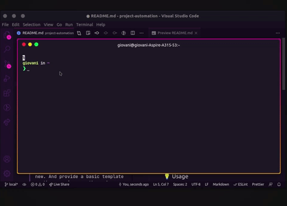

<div align="center">
  

  <h1>Project Automation</h1>

</div>

<p>This project was created with the purpose of automating my workflow when studying or testing something new about programming</p>

<div align="center">
  
</div>

<br >
<br >

<h2>📝 About</h2>
<p>By sharing this project, I mean to help other devs that might also be going through the same boring process of starting a new project just to study or test something new. And provide a basic template so they can improve the code as they need to.</p>

<br >

<h2>💡 Usage</h2>

- Clone this repo

```bash
  $ git clone https://github.com/giovaniif/project-automation.git
```

- Add this line to your **.bashrc** (_or some other file you are using to manage your terminal, like_ **.zshrc**)

```
  source path/to/cloned/project/project-automation/commands.sh
```

- This will add a **create** command to your terminal

- Before using, at the same folder where your .bashrc file is you must also create a .env file following the example on this project. The _$BASE_PATH_ variable represents the parent directory where your projects will be created

**Feel free to modify the commands.sh file as you want to match your needs**

<h2>👐 Contributing</h2>

Feel free to create a new issue with a respective title and description on the repository. If you already found a solution to your problem, or added a new feature, I would love to review your pull request!

<h2>📨 Contact</h2>

Made with love by Giovani Farias.
👋 [Get in Touch](https://www.linkedin.com/in/giovani-ricco-farias-b97316186/)

This project is under the [MIT license](./LICENSE).

Please give me a ⭐ if this project helped you!
